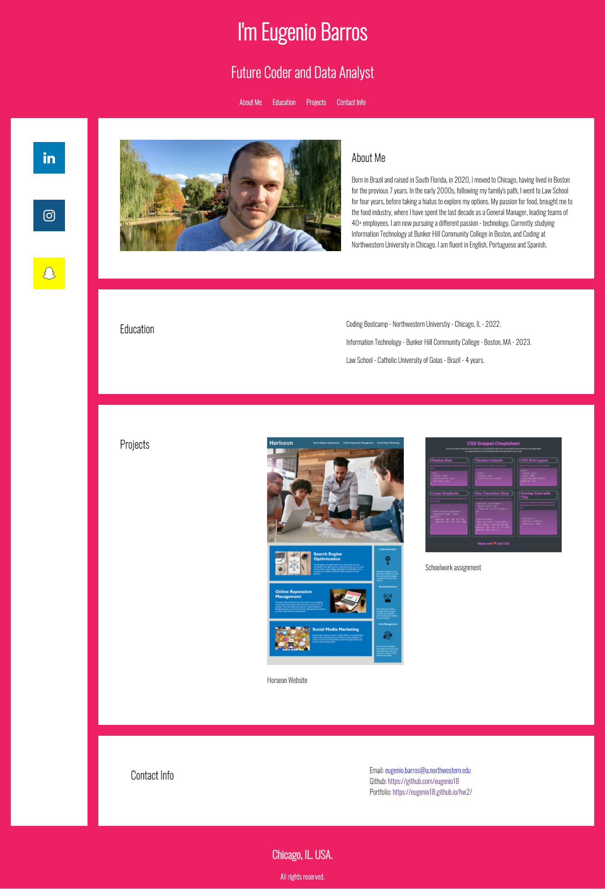

# hw2
PROJECT: 

    PERSONAL PORTFOLIO 

    This is my personal portfolio to showcase my education and work experience and giving access to multiple forms of getting in touch with me. 
    It was built to meet all accessibility standards by keeping semantic HTML elements. 

LAYOUT:

    It consists of: 

      1. Introductory name and aspiration.
      2. Navigation bar - Links to all sections of the page.
      3. Side Card - Social media icons and link.
      3. Sections - Cards with image and text.
      5. Footer - Final credits.

LANGUAGE:

    ATOMIC CSS
        The code was written in an ATOMIC CSS style, in order to consolidate the CSS sheet and have a "cleaner" html. 

    MEDIA QUERY
        The code is easily accessible at the bottom of the CSS file page.

SCREENSHOT:

LINKS:

[Repo](https://github.com/eugenio18/hw2.git)

[Page](https://eugenio18.github.io/hw2/)
 

HOW TO CONTRIBUTE:

    Any changes made to the files, please log below as follow:
        Example: 05/21 - HTML - changed class on body > nav > ul > li 1
                 05/21 - CSS - added class "c-white"

CHANGES:

12/29 - MAIN - Added full description to README.md
12/29 - HTML - Added nav bar on header.

